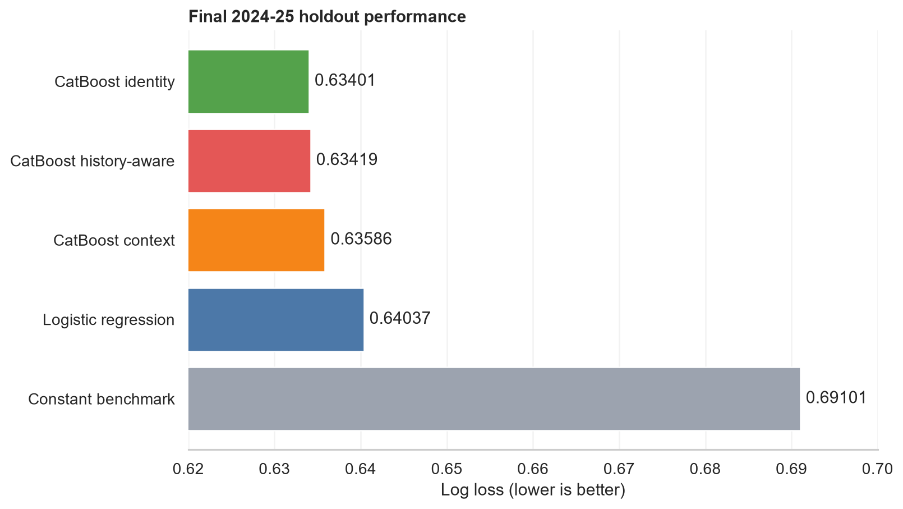
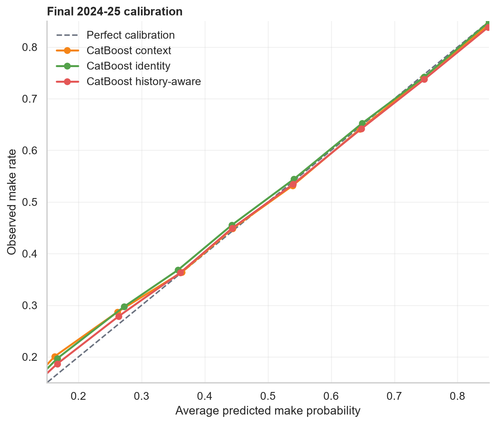
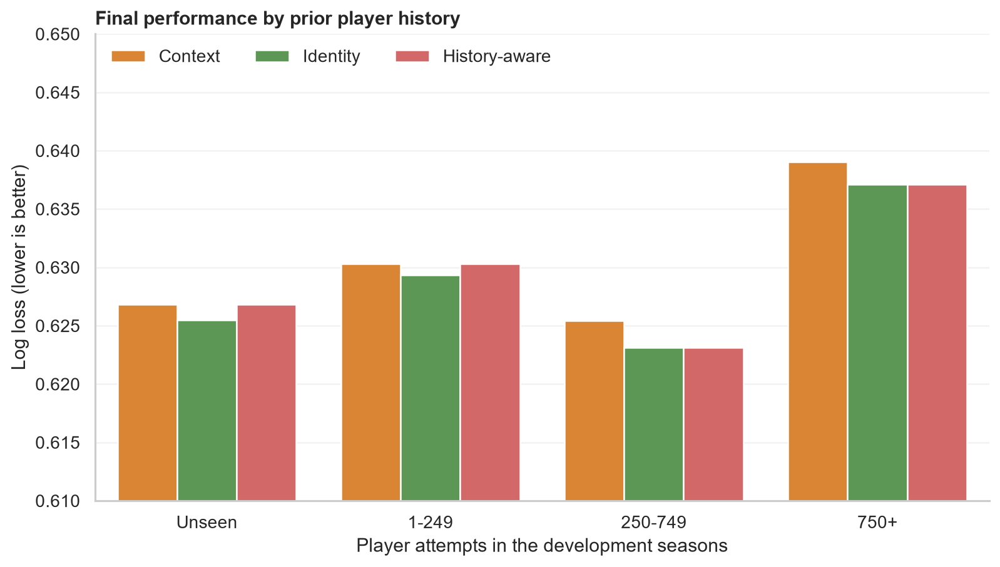

# NBA Shot Probability Modeling

An end-to-end sports analytics project that estimates the probability of an NBA field-goal attempt being made from information available before the outcome. The project compares an interpretable logistic regression baseline with CatBoost models that learn nonlinear spatial effects and categorical shot context.

## Project question

How accurately can shot context and court location estimate make probability across future NBA seasons, and when does adding player identity improve those estimates?

This is a probability-estimation problem rather than a simple made-or-missed classification task. Well-calibrated probabilities are useful for comparing shot quality, evaluating decisions over many attempts, and supporting basketball analysis without treating any single shot as certain.

## Key results

- Evaluated the locked workflow once on **219,527 shots from the 2024-25 season**.
- The selected history-aware CatBoost model reached **0.63419 log loss**, improving **0.97% over logistic regression** and **0.26% over context-only CatBoost**.
- Raw player-identity CatBoost recorded the best log loss at **0.63401**, but its calibration error was more than twice that of the history-aware model (**0.01027 vs. 0.00457 ECE**).
- The history-aware rule was retained because it was selected before the final holdout was opened: use player identity after 250 prior attempts and otherwise fall back to context-only predictions.



## Data and validation

The project uses public regular-season shot-detail data from the [NBA Data Archive](https://huggingface.co/datasets/cdechoch/nba-data-archive), whose dataset card lists an Apache-2.0 license. The analysis pins source revision `73fb165135d4d1ef8daaad26fb5b9a29b9d2bdee` for reproducibility. Raw data is not stored in this repository.

| Season | Role | Shots |
| --- | --- | ---: |
| 2021-22 | Development | 216,722 |
| 2022-23 | Development | 217,218 |
| 2023-24 | Development | 218,701 |
| 2024-25 | Locked final holdout | 219,527 |

Model choices were made with expanding season-held-out validation inside the first three seasons. The 2024-25 target was then used for one final evaluation; it was not used to select features, model depth, iteration counts, the player-history threshold, or calibration.

## Modeling approach

1. **Data validation:** confirmed a binary target, unique game-event keys, consistent season schemas, valid feature ranges, and no overlap between development and holdout events.
2. **Leakage-safe features:** created location, shot-distance, shot-angle, period-clock, overtime, corner-three, shot-type, action-type, and court-zone features using one reusable transformation.
3. **Baselines:** compared a training make-rate benchmark with L2-regularized logistic regression using fold-local scaling and one-hot encoding.
4. **CatBoost:** modeled nonlinear relationships and categorical context directly, then tested player and team identity as a controlled ablation.
5. **Reliability checks:** evaluated log loss, Brier score, calibration, and performance across distance, action, zone, clock, and player-history groups.

### Final holdout performance

Lower values are better for all three metrics.

| Model | Log loss | Brier score | ECE |
| --- | ---: | ---: | ---: |
| CatBoost identity | **0.63401** | **0.22283** | 0.01027 |
| **CatBoost history-aware — selected** | 0.63419 | 0.22291 | 0.00457 |
| CatBoost context | 0.63586 | 0.22366 | **0.00368** |
| Logistic regression | 0.64037 | 0.22556 | 0.00724 |
| Constant benchmark | 0.69101 | 0.24893 | 0.00307 |

The constant benchmark's low ECE does not make it a useful model: predicting nearly the same league-average probability for every shot can be calibrated overall while providing little shot-level separation. Log loss and Brier score capture that weakness.



## What the final test revealed

During development, raw player identity hurt predictions for unseen and low-history players in both temporal folds. That evidence led to the fixed 250-attempt fallback rule. On the final 2024-25 season, identity unexpectedly helped those groups slightly, so raw identity narrowly beat the selected model on log loss.

This difference is reported rather than optimized away. It illustrates why sports models need out-of-time testing: player movement, roster turnover, role changes, and season-specific shot distributions can change how identity features behave.



## Repository structure

```text
notebooks/                  Executed analysis in project order
  01_data_understanding.ipynb
  02_feature_engineering.ipynb
  03_baselines.ipynb
  04_catboost_model.ipynb
  05_diagnostics.ipynb
  06_final_workflow.ipynb
src/                        Reusable features, models, metrics, and diagnostics
tests/                      Automated data and modeling checks
scripts/                    Reproducible reporting utilities
reports/                    Methodology and public figures
```

Generated models, row-level predictions, and raw data are intentionally ignored by Git.

## Reproduce the project

The completed workflow was executed with Python 3.14.6.

```bash
python -m venv .venv
# Windows: .venv\Scripts\activate
# macOS/Linux: source .venv/bin/activate
python -m pip install -r requirements.txt
```

Download and verify the four season files from the pinned public source:

```bash
python src/download_data.py
```

The script saves them at:

```text
data/raw/2021.parquet
data/raw/2022.parquet
data/raw/2023.parquet
data/raw/2024.parquet
```

Run notebooks `01` through `06` in order. Then run the checks and rebuild the report figures:

```bash
python -m unittest discover -s tests -v
python scripts/build_report_figures.py
```

## Limitations

- The public data does not contain defender distance, possession shot clock, dribbles, touch time, shooter movement, or detailed game-state pressure.
- Shot probabilities describe associations in recorded context; they do not isolate causal player skill or decision quality.
- Player identity can shift across seasons as roles, health, teammates, and shot selection change.
- The 250-attempt rule is a practical development-time safeguard, not a universal basketball threshold.
- The final holdout has been closed to further model selection. Future improvements require a new out-of-time test period.

## Additional documentation

- [Methodology and decision rationale](reports/methodology.md)
- [Final reproducible workflow](notebooks/06_final_workflow.ipynb)
- [Feature engineering module](src/features.py)
- [Final model workflow](src/final_workflow.py)

## AI assistance

AI tools were used as a development assistant for project planning, code scaffolding and review, test design, workflow automation, and documentation refinement. Model choices were evaluated with temporal validation, all reported results were produced by executed local code, and the final holdout was not used for post-test tuning.

## Tools

Python, pandas, NumPy, scikit-learn, CatBoost, Matplotlib, Seaborn, PyArrow, Jupyter, Git, and GitHub.
